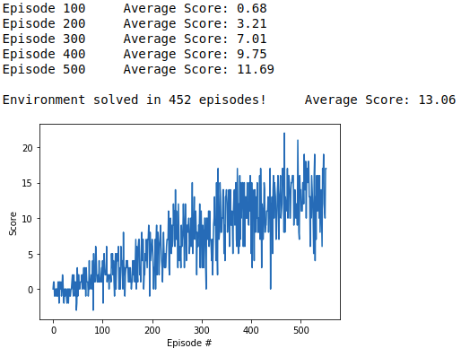

For this project, I trained an agent to navigate and collect bananas in a large, square world. The file `dqn_agent.py` contains the definition of the Agent along with a ReplayBuffer that it uses to sample previous experiences during learning. `model.py` defines a QNetwork that is used to create a function approximator for the action-values. This network consists of 2 fully connected hidden layers following by a fully connected ouput layer with number of nodes corresponding to number of actions. ReLU activations follow the first two layers. Actions are then chosen following an epsilon-greedy policy with epsilon linearly annealed by 0.995 from 1.0 to 0.01 after each episode during training. Q values are updated according to the method developed in the [Deep Q-Network](https://storage.googleapis.com/deepmind-media/dqn/DQNNaturePaper.pdf) paper from 2015 by Mnih, et. al where 2 networks are maintained by the agent - a local and a target - and the local network seeks to become the target network through weight updates.

The agent was able to solve the environment in 452 episodes.

A possible improvement to the algorithm is prioritized experience replay where certain experiences are assigned greater importance and sampled more frequently. Another interesting improvement is learning from raw pixel values. In this case, a convolutional neural network would need to precede the fully connected layers in the QNetwork.